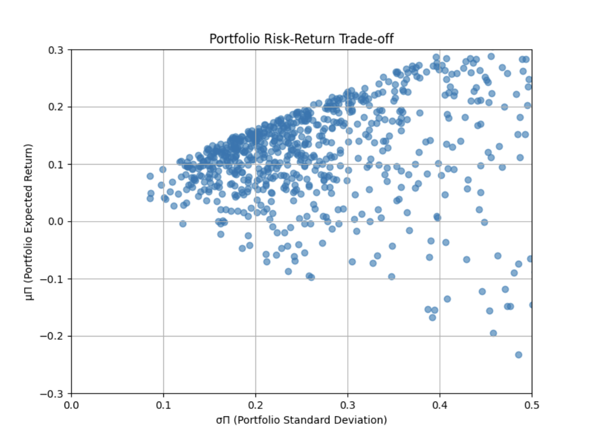
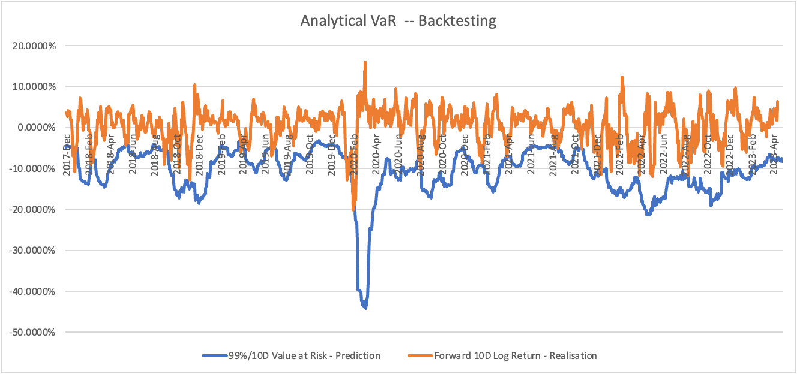
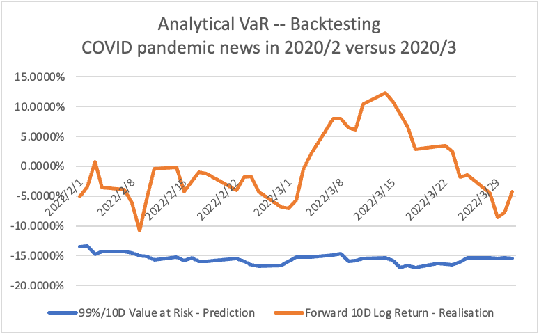
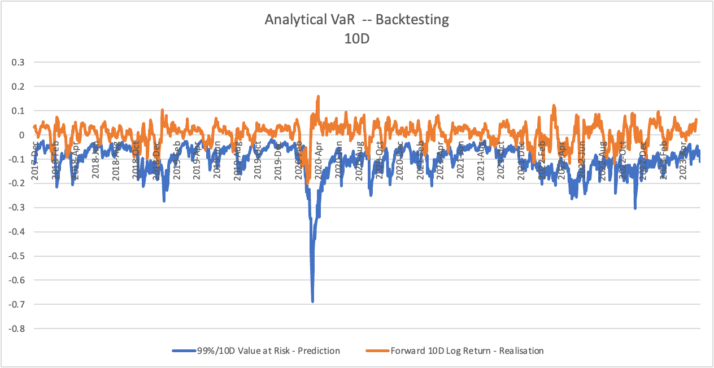

# CQF Exam One

## Question 1

The budget constraint $\omega'$ 1 = 1 means $\omega_1+\omega_2+\omega_3+\omega_4=1$. Our goal is to minimise the variance of the portfolio, i.e. to minimise $\frac{1}{2}\omega'\Sigma\omega$, while satisfying the budget constraint $\omega_1+\omega_2+\omega_3+\omega_4=1$.

The objective of the Lagrange multiplier method is to construct a Lagrange function and then minimise it.

Below is the detailed process to derive the analytical solution for optimal allocations ${\omega}^{*}$.

The Lagrangian multiplier method is

$L(\omega,\lambda)=\frac{1}{2}\omega'\Sigma\omega+\lambda(1-\omega'1)$.

Where $\lambda$ is the Lagrangian multiplier. I now compute the Lagrangian function for The partial derivatives of $\lambda$,${\omega}_{1}$,${\omega}_{2}$,${\omega}_{3}$,${\omega}_{4}$ and make them equal to zero to solve the optimal solution.

1. Take the partial derivative of $\omega$ and make it zero.

$$
\begin{aligned}

\frac{\partial L}{\partial\omega}&=\frac{\partial \frac{1}{2}\omega'\Sigma\omega+\lambda(1-\omega'1)}{\partial\omega}\\
&=\Sigma\omega+\lambda1,(cause:f(T)=TA'T,then:\frac{\partial f(T)}{\partial T}=2AT)\\
&=0
\end{aligned}
$$

2. Take the partial derivative of $\lambda$ and make it zero.

$$
\begin{aligned}

\frac{\partial L}{\partial\lambda}&=\frac{\partial \frac{1}{2}\omega'\Sigma\omega+\lambda(1-\omega'1)}{\partial\lambda}\\
&=1'\omega-1\\
&=0
\end{aligned}
$$

3. Now I have the set of equations, where 1 is the all-1 column vector.

$$
\begin{cases}
\Sigma\omega+\lambda1=0,①\\
1'\omega-1=0,②\\
\end{cases}
$$

4. Next, I will compute $\lambda$. According to equation①,

$$
\Sigma\omega+\lambda1=0\\
{\Sigma}^{-1}\Sigma\omega+{\Sigma}^{-1}\lambda1=0\\
\omega+{\Sigma}^{-1}\lambda1=0\\
\omega=-\lambda{\Sigma}^{-1}1
$$

5. Next, I will substitute $\omega$ into equation②.

$$
1'(-\lambda{\Sigma}^{-1}1)-1=0\\
\lambda=\frac{1}{1'{\Sigma}^{-1}1}
$$

6. Next, I will substitute $\lambda$ into equation①.

$$
\Sigma\omega+\frac{1}{1'{\Sigma}^{-1}1}1=0
$$

$$
{\Sigma}^{-1}\Sigma\omega+\frac{{\Sigma}^{-1}}{1'{\Sigma}^{-1}1}1=0
$$

$$
{\omega}^{*}=\frac{{\Sigma}^{-1}1}{1'{\Sigma}^{-1}1}
$$

This is the analytic solution for optimal allocations ${\omega}^{*}=\frac{{\Sigma}^{-1}1}{1'{\Sigma}^{-1}1}$.


---


Then I will compute optimal allocations (Global MV portfolio) for the given investment universe.

1. First compute $\Sigma$.

$$
\Sigma=diag(\sigma)*Corr*diag(\sigma)\\
,where\ diag(\sigma) is\ the\ diagonal\ matrix\ containing\ the\ standard\ deviation.
$$

$$
\begin{aligned}
\Sigma&=
\begin{pmatrix}  
0.07*0.07*1 & 0.07*0.28*0.4 & 0.07*0.25*0.3 & 0.07*0.31*0.3\\  
0.28*0.07*0.4 & 0.28*0.28*1 & 0.28*0.25*0.27 & 0.28*0.31*0.42\\  
0.25*0.07*0.3 & 0.25*0.28*0.27 & 0.25*0.25*1 & 0.25*0.31*0.5\\
0.31*0.07*0.3 & 0.31*0.28*0.42 & 0.31*0.25*0.5 & 0.31*0.31*1\\
\end{pmatrix}\\
&=\begin{pmatrix}
0.0049  & 0.00784  & 0.00525 & 0.00651 \\
0.00784 & 0.0784   & 0.0189  & 0.036456\\
0.00525 & 0.0189   & 0.0625  & 0.03875 \\
0.00651 & 0.036456 & 0.03875 & 0.0961  \\
\end{pmatrix}
\end{aligned}
$$

3. The following steps are more complex and I will calculate them using python's numpy library.

```python
import numpy as np

# Defining asset information
mu = np.array([0.05, 0.07, 0.15, 0.22])
sigma = np.array([0.07, 0.28, 0.25, 0.31])
w = np.array([0.25, 0.25, 0.25, 0.25])

# Define the correlation matrix
corr = np.array([[1, 0.4, 0.3, 0.3],
                 [0.4, 1, 0.27, 0.42],
                 [0.3, 0.27, 1, 0.5],
                 [0.3, 0.42, 0.5, 1]])

# Calculate the covariance matrix
cov = np.diag(sigma) @ corr @ np.diag(sigma)

# Compute eigenvalues and eigenvectors
eigvals, eigvecs = np.linalg.eig(cov)
```

$$
eigvals=[0.14707938, 0.0038642, 0.05460673, 0.0363497]
$$

$$
eigvecs=
\begin{pmatrix}
-0.07828434 & -0.994989 & 0.04215969 & -0.04572765 \\
-0.51697024 & -0.08406065 & -0.83359425 & 0.17548846 \\
-0.45160342 & 0.05196731 & 0.44744562 & -0.77015983 \\
-0.7229576 & 0.01516905 & -0.32114732 & 0.6115281 \\
\end{pmatrix}
$$

3. use python cvxpy library

```python
import cvxpy as cp

w = cp.Variable(4)
objective = cp.Minimize(cp.quad_form(w, cov))
constraints = [cp.sum(w) == 1, w >= 0]
```

In the above code, cp.Minimize(cp.quad_form($\omega$, $\Sigma$)) means to minimise the quadratic function $\omega'\Sigma\omega$ as an objective function. This objective function is the objective function of the global minimum variance portfolio problem, where $\omega$ is the weight vector of the portfolio and $\Sigma$ is the covariance matrix. Therefore, by minimising $\omega'\Sigma\omega$, the weight vector of the global minimum variance portfolio can be obtained.

4. compute optimal allocations

```python
prob = cp.Problem(objective, constraints)
prob.solve()
print(w.value)
```

5. The optimal allocations is
   $$
   [0.201, 0.187, 0.312, 0.200]
   $$

   That is, the optimal asset allocation is 20.1% weighting of asset A, 18.7% weighting of asset B, 31.2% weighting of asset C and 20.0% weighting of asset D.

<div STYLE="page-break-after: always;"></div>

## Question 2

The problem can be solved by Lagrange multiplier method.

1. First, the objective function can be expressed as follows:

$$
L(\omega,\lambda_1,\lambda_2) = \frac{1}{2}\omega^T\sum \omega - \lambda_1(\omega^T1-1) - \lambda_2(\omega^T\mu-m)
$$

where $\omega$ is the weight vector, $\sum$ is the covariance matrix, $\mu$ is the expected return vector, $m$ is the target return, and $\lambda_1$ and $\lambda_2$ are the Lagrange multipliers. The following problem needs to be solved:

$$
\min_\omega L(\omega,\lambda_1,\lambda_2)
$$

2. Derivate $\omega$ to get:

$$
\frac{\partial L}{\partial \omega} = \Sigma \omega - \lambda_1 1 - \lambda_2 \mu = 0
$$

$$
\omega = {\Sigma}^{-1}(\lambda_1 1 + \lambda_2 \mu)\\
\omega={\Sigma}^{-1}(\lambda_{1}1+\lambda_2\mu)
$$

3. Multiplying both sides by $1'$ simultaneously gives.

$$
1'\omega=1'\Sigma^{-1}(\lambda_{1}1+\lambda_2\mu)\\
cause: 1'\omega=1\\
therefore:1=\lambda_{1}1'\Sigma^{-1}1+\lambda_21'\Sigma^{-1}\mu,①
$$

4. Multiply both sides simultaneously by $\mu'$ to obtain:

$$
\mu'\omega=\mu'\Sigma^{-1}(\lambda_{1}1+\lambda_2\mu)\\
cause:\mu'\omega=m\\
therefore:m=\lambda_{1}\mu'\Sigma^{-1}1+\lambda_{2}\mu'\Sigma^{-1}\mu,②
$$

5. Thus the set of equations is obtained:

$$
\begin{cases}
1=\lambda_{1}1'\Sigma^{-1}1+\lambda_21'\Sigma^{-1}\mu,①\\
m=\lambda_{1}\mu'\Sigma^{-1}1+\lambda_{2}\mu'\Sigma^{-1}\mu,②\\
\end{cases}
$$

6. Solve using the commutative method and simplify the calculations by defining three constants A, B and C:

$$
\begin{cases}
A=1'\Sigma^{-1}1\\
B=1'\Sigma^{-1}\mu\\
C=\mu'\Sigma^{-1}\mu
\end{cases}
$$

7. So the system of equations is transformed:

$$
\begin{cases}
\lambda_{1}A+\lambda_{2}B=1\\
\lambda_{1}B+\lambda_{2}C=m
\end{cases}
$$

8. Solve for $\lambda_{1}$ and $\lambda_{2}$ by Cramer's Law:

$$
\lambda_{1} = \frac{\begin{vmatrix}1&B\\ m&C\end{vmatrix}}{\begin{vmatrix}A&B\\ B&C\end{vmatrix}}=\frac{C-mB}{AC-B^2}
$$

$$
\lambda_{2}= \frac{\begin{vmatrix}A&1\\ B&m\end{vmatrix}}{\begin{vmatrix}A&B\\ B&C\end{vmatrix}} = \frac{mA-B}{AC-B^2}
$$

9. Define $\Delta=AC-B^{2}$, obtained to simplify the calculation:

$$
\omega^{*}=\Sigma^{-1}(\frac{C-mB}{\Delta})1+\frac{mA-B}{\Delta}\Sigma^{-1}\mu\\
$$

$$
\omega^{*}=\frac{C-mB}{\Delta}\Sigma^{-1}1+\frac{mA-B}{\Delta}\Sigma^{-1}\mu
$$

Now, I take all these constants into the $\omega^{*}$ formula and simplify it, then have:

$$
\omega^* = \frac{1}{4}\Sigma^{-1}(\mu - m\frac{\Sigma^{-1}\mu}{\mu'\Sigma^{-1}\mu})
$$


---


11. Calculate $\sigma^{2}$ to get:

$$
\begin{aligned}
\sigma^{2}&=\omega'\Sigma\omega\\
&=\omega'\Sigma(\frac{C-mB}{\Delta}\Sigma^{-1}1+\frac{mA-B}{\Delta}\Sigma^{-1}\mu)\\
&=\frac{C-mB}{\Delta}\omega'\Sigma\Sigma^{-1}1+\frac{mA-B}{\Delta}\omega'\Sigma\Sigma^{-1}\mu\\
&=\frac{C-mB}{\Delta}\omega'1+\frac{mA-B}{\Delta}\omega'\mu\\
&=\frac{C-mB}{\Delta}+\frac{mA-B}{\Delta}m\\
&=\frac{Am^{2}-2mB+C}{\Delta}\\
&=\frac{A}{\Delta}(m-\frac{B}{A})^{2}+\frac{1}{A}\\
\end{aligned}
$$

Therefore, when $m=\frac{B}{A}$, the minumn of portfolio risk $\sigma_{\prod}=\sqrt{\omega'\Sigma\omega}=\sqrt{\frac{A}{\Delta}(m-\frac{B}{A})^{2}+\frac{1}{A}}=\sqrt{\frac{1}{A}}$


---


Next, I will compute the portfolio risk for three levels of correlation.

The scaling factors $x$ are 1, 1.3 and 1.8 respectively. The initial correlation matrix $\rho$ is:

$$
\rho = \begin{bmatrix}
1 & 0.4 & 0.3 & 0.3 \\
0.4 & 1 & 0.27 & 0.42 \\
0.3 & 0.27 & 1 & 0.5 \\
0.3 & 0.42 & 0.5 & 1
\end{bmatrix}
$$

For each element $\rho_{ij}$, the following rules will be applied to calculate the scaled value $\rho_{scaled_{ij}}$:

$$
\rho_{scaled_{ij}} = \begin{cases}
\rho_{ij} \times x, & \text{if} \ \rho_{ij} \times x \leq 0.99 \\
0.99, & \text{if} \ \rho_{ij} \times x > 0.99
\end{cases}
$$


---


1. Calculate the scaled correlation matrix $\rho_{scaled}$.

When $x=1$, $\rho_{scaled}=\rho$.

$$
\rho_{scaled} = \begin{bmatrix}
1 & 0.4 & 0.3 & 0.3 \\
0.4 & 1 & 0.27 & 0.42 \\
0.3 & 0.27 & 1 & 0.5 \\
0.3 & 0.42 & 0.5 & 1
\end{bmatrix}
$$

When $x=1.3$, $\rho_{scaled}=\rho$.

$$
\rho_{scaled} = \begin{bmatrix}
   1 & 0.52 & 0.39 & 0.39 \\
   0.52 & 1 & 0.351 & 0.546 \\
   0.39 & 0.351 & 1 & 0.5 \\
   0.39 & 0.546 & 0.5 & 1
   \end{bmatrix}
$$

When $x=1.8$, $\rho_{scaled}=\rho$.

$$
\rho_{scaled} = \begin{bmatrix}
   1 & 0.72 & 0.54 & 0.54 \\
   0.72 & 1 & 0.486 & 0.756 \\
   0.54 & 0.486 & 1 & 0.9 \\
   0.54 & 0.756 & 0.9 & 1
   \end{bmatrix}
$$

2. Calculate the portfolio risk $\sigma_{\Pi} = \sqrt{\omega^T \Sigma \omega}$.

   For each scaling factor $x$, follow the steps below to calculate portfolio risk:

   a. Calculate the covariance matrix $\Sigma$b. Calculate the inverse matrix of the covariance matrix $\Sigma^{-1}$c. Calculate the optimal weights $\omega^*$$\omega^*_{x=1} = [0.05600229, 0.30339868, 0.33581183, 0.3047872]$$\omega^*_{x=1.3} = [0.04805233, 0.2968552, 0.32851019, 0.32658228]$$\omega^*_{x=1.8} = [0.0301677, 0.26687096, 0.30849996, 0.39446139]$\

   d. Calculate portfolio risk $\sigma_{\Pi} = \sqrt{\omega^{*T} \Sigma \omega^*}$:$\sigma_{\Pi,x=1} = 0.24243704960178165$\\$\sigma_{\Pi,x=1.3} = 0.22374124592736818$\\$\sigma_{\Pi,x=1.8} = 0.22308884699769566$\\
3. Organise the results of the calculations in a table:

| $x$ | $\rho_{scaled}$ | $\omega^*$                                    | $\sigma_{\Pi}$    |
| ----- | ----------------- | ----------------------------------------------- | ------------------- |
| 1     | see above         | [0.05600229, 0.30339868, 0.33581183, 0.3047872] | 0.24243704960178165 |
| 1.3   | see above         | [0.04805233, 0.2968552, 0.32851019, 0.32658228] | 0.24243704960178165 |
| 1.8   | see above         | [0.0301677, 0.26687096, 0.30849996, 0.39446139] | 0.24243704960178165 |

<div STYLE="page-break-after: always;"></div>

## Question 3

### Sub-Question 1

The Sharpe Ratio is a measure of a portfolio's risk-adjusted return, defined as the ratio of a portfolio's expected return to its risk (standard deviation). The formula for calculating the Sharpe ratio is:

$$
Sharpe\ Ratio = \frac{E(R_p - R_f)}{\sigma_p}
$$

where:

- $E(R_p - R_f)$ is the portfolio's expected excess return (the portfolio's expected return minus the risk-free rate of return);
- $\sigma_p$ is the standard deviation (risk) of the portfolio.

In this formula, the main parameters that scale over time are the expected excess return $R_p$ and the standard deviation $\sigma_p$.

### Sub-Question 2

- Daily Sharpe Ratio:

  $$
  =0.53 \times \sqrt{252}=8.4135
  \\ (Assuming\ 252\ trading\ days\ in\ a\ year)
  $$
- Monthly Sharpe Ratio:

  $$
  0.53 \times \sqrt{12}=1.8360
  \\ (Assuming\ 12\ months\ in\ a\ year)
  $$
- Quarterly Sharpe Ratio:

  $$
  0.53 \times \sqrt{4}=1.06
  \\ (Assuming\ 4\ quarters\ in\ a\ year)
  $$

### Sub-Question 3

For each time scale, the loss probability can be calculated by setting the value of the standard normal random variable $x$ to the corresponding negative Sharpe\ Ratio$ and then calculating the probability that $x$ is less than or equal to this value.

$$
Loss\ Probability = Pr(x < -Sharpe\ Ratio)
$$

Calculations were made directly using the standard normal distribution table:

```python
import scipy.stats as stats

# Given annualized Sharpe Ratio
annualized_SR = 0.53

# Calculate time scale adjustment factors
daily_adj_factor = annualized_SR / (252 ** 0.5)  # Assuming 252 trading days in a year
monthly_adj_factor = annualized_SR / (12 ** 0.5)  # Assuming 12 months in a year
quarterly_adj_factor = annualized_SR / (4 ** 0.5)  # Assuming 4 quarters in a year
annually_adj_factor = annualized_SR

# Calculate loss probabilities using standard normal distribution CDF
daily_loss_prob = stats.norm.cdf(-daily_adj_factor)
monthly_loss_prob = stats.norm.cdf(-monthly_adj_factor)
quarterly_loss_prob = stats.norm.cdf(-quarterly_adj_factor)
annually_loss_prob = stats.norm.cdf(-annually_adj_factor)

print("Daily Loss Probability:", daily_loss_prob)
print("Monthly Loss Probability:", monthly_loss_prob)
print("Quarterly Loss Probability:", quarterly_loss_prob)
print("Annually Loss Probability:", annually_loss_prob)
```

The output is:

```python
Daily Loss Probability: 0.4866830433008509
Monthly Loss Probability: 0.439199996693031
Quarterly Loss Probability: 0.395504730907446
Annually Loss Probability: 0.29805596539487644
```

Therefore, evaluating the P&L more frequently make it appear more risky than it actually is.

<div STYLE="page-break-after: always;"></div>

## Question 4

```python
import numpy as np
import matplotlib.pyplot as plt

# Set the random seed for reproducibility
np.random.seed(42)

# Generate 700 random allocation sets (4x1 vectors)
num_sets = 1000
allocation_sets = np.random.randn(num_sets, 4)
print(allocation_sets)

# Standardize each allocation set
normalized_sets = allocation_sets / np.sum(allocation_sets, axis=1, keepdims=True)

# Compute expected returns and standard deviations for each set
mu = np.array([0.05, 0.07, 0.15, 0.22])
sigma = np.array([0.07, 0.28, 0.25, 0.31])

# Define the correlation matrix
corr = np.array([[1, 0.4, 0.3, 0.3],
                 [0.4, 1, 0.27, 0.42],
                 [0.3, 0.27, 1, 0.5],
                 [0.3, 0.42, 0.5, 1]])

# Calculate the covariance matrix
cov_matrix = np.diag(sigma) @ corr @ np.diag(sigma)

# Expected returns for assets
mu_portfolio = np.dot(normalized_sets, mu)
sigma_portfolio = np.sqrt(np.diag(np.dot(np.dot(normalized_sets, cov_matrix), normalized_sets.T)))

# Plot the cloud of points
# This line of code creates a new graphics window and sets its size to 8 inches wide by 6 inches high.
plt.figure(figsize=(8, 6))

# This line of code uses the scatter() function to plot a scatterplot. sigma_portfolio and mu_portfolio are two arrays representing the standard deviation and expected return of the portfolio, respectively. the alpha parameter sets the transparency of the points, which is set to 0.6 here.
plt.scatter(sigma_portfolio, mu_portfolio, alpha=0.6)

plt.xlabel('σΠ (Portfolio Standard Deviation)')
plt.ylabel('µΠ (Portfolio Expected Return)')
plt.title('Portfolio Risk-Return Trade-off')
plt.grid(True)
plt.xlim(0, 0.5)  # Set x-axis limits
plt.ylim(-0.3, 0.3)  # Set y-axis limits
plt.show()

```



The Risk & Return chart is similar in concept to a classic efficient frontier image that maps the average return and standard deviation tradeoffs for any combination of assets. It is an elliptical curve with the upper half being the effective frontier. The points on the left boundary of the efficient frontier are called the global minimum variance portfolio (GMVP).

<div STYLE="page-break-after: always;"></div>

## Question 5

### Sub Question (a)-(c)

I use the Excel formulas to compute, details can see in the excel file and the Question5 sheet.

$$
Except\ 1.00\%\ OR\ 13.5\ breaches\
$$

$$
Actual(10D)\ 2.52\%\ OR\ 34\ breaches\
$$

$$
Consecutive\ VaR\ breaches\ 18\
$$



### Sub Question (d)

Between 2020/2 and 2020/3, the prediction of 99%/10D Value at Risk is relatively flat. And relative to other times, its prediction is also lower, influenced by the Covid-19 pandemic. Whereas the actual Forward 10D Log Return is higher and there are no VaR Breaches. there is a large increase at the beginning of 2020/3, possibly due to the belief that the impact of the Covid-19 pandemic will not be significant, but then there is a large fall, suggesting that capital is beginning to lack confidence. All in all, the capital market was more volatile and investment risk was higher in the early period due to the impact of Covid-19.



## Question 6

### Sub Question (a)-(c)

I use the Excel formulas to compute, details can see in the excel file and the Question6 sheet.

$$
Except\ 1.00\%\ OR\ 13.5\ breaches\
$$

$$
Actual(10D)\ 3.58\%\ OR\ 49\ breaches,\ Consecutive\ VaR\ breaches\ 22
$$



### Sub Question (d)

The parameter λ in an exponentially weighted moving average (EWMA) model controls the weight assigned to past observations in forecasting volatility. Smaller values of λ lead to smoother forecasts by giving more weight to historical observations. This can lead to a slower response to recent changes in volatility. Conversely, larger values of λ give more weight to recent observations, making forecasts more responsive but potentially less stable due to greater sensitivity to noise in the data.The choice of λ depends on the trade-off between responsiveness to recent changes and stability of volatility forecasts.
Whereas Q5 and Q6 are predicted using two different methods, the number of VaR breaches predicted using EWMA is higher than the number of VaR Beaches predicted using Historical Simulation, this is because EWMA predictions are based on a weighted average of the historical observations, focusing more on the recent data, and therefore may be more sensitive to short-term volatility changes. In contrast, the formula VaR_{10D,t} uses a longer time window (10 days) in the calculation of VaR and therefore focuses more on long-term trends. If EWMA is used based on a 30-day time window, then fewer VaR Breaches will be calculated. The calculation is as follows.

$$
Actual(30D)\ 0.66\%\ OR\ 9\ breaches,\ Consecutive\ VaR\ breaches\ 7
$$
